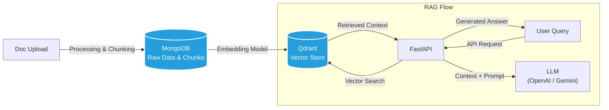

# Contest-Rag

A robust Retrieval-Augmented Generation (RAG) system built with FastAPI, MongoDB, and Qdrant. This application allows users to upload documents, automatically chunk and index them, and perform context-aware Q&A using advanced LLMs.

## Architecture

The system follows a modern RAG pipeline, separating data ingestion from the retrieval-augmented generation flow.


## Tech Stack

-   **Backend Framework**: [FastAPI](https://fastapi.tiangolo.com/) - High-performance async web framework.
-   **Database**:
    -   [MongoDB](https://www.mongodb.com/) (via [Motor](https://motor.readthedocs.io/)) - Stores raw document assets and metadata.
    -   [Qdrant](https://qdrant.tech/) - Vector database for efficient semantic search.
-   **AI & LLM**:
    -   [LangChain](https://www.langchain.com/) - Orchestration framework.
    -   **LLMs**: Supports OpenAI, Gemini, and Cohere.
-   **Processing**:
    -   [PyMuPDF](https://pymupdf.readthedocs.io/) - efficient PDF processing.

## Key Features

-   **Document Ingestion**: Upload PDF documents via REST API.
-   **Automatic Indexing**: Documents are automatically processed, chunked, and embedded into the vector store.
-   **Context-Aware QA**: Ask questions about your documents and receive answers grounded in the uploaded content.
-   **Hybrid Storage**: Combines MongoDB for document management with Qdrant for vector search.

## Getting Started

1.  **Clone the repository**:
    ```bash
    git clone <repository_url>
    cd Contest-Rag
    ```

2.  **Set up environment variables**:
    Copy `.env.example` to `.env` and configure your API keys (OpenAI/Gemini) and database credentials.

3.  **Run with Docker**:
    ```bash
    docker-compose up -d
    ```

4.  **Access the API**:
    Navigate to `http://localhost:8000/docs` to view the interactive API documentation.
