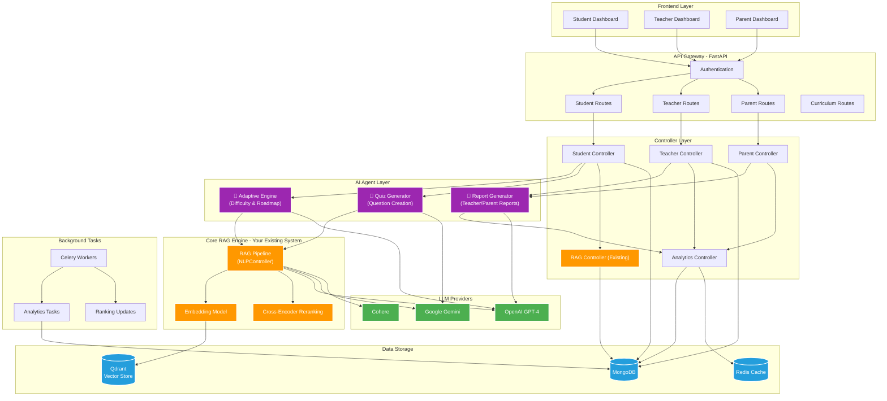
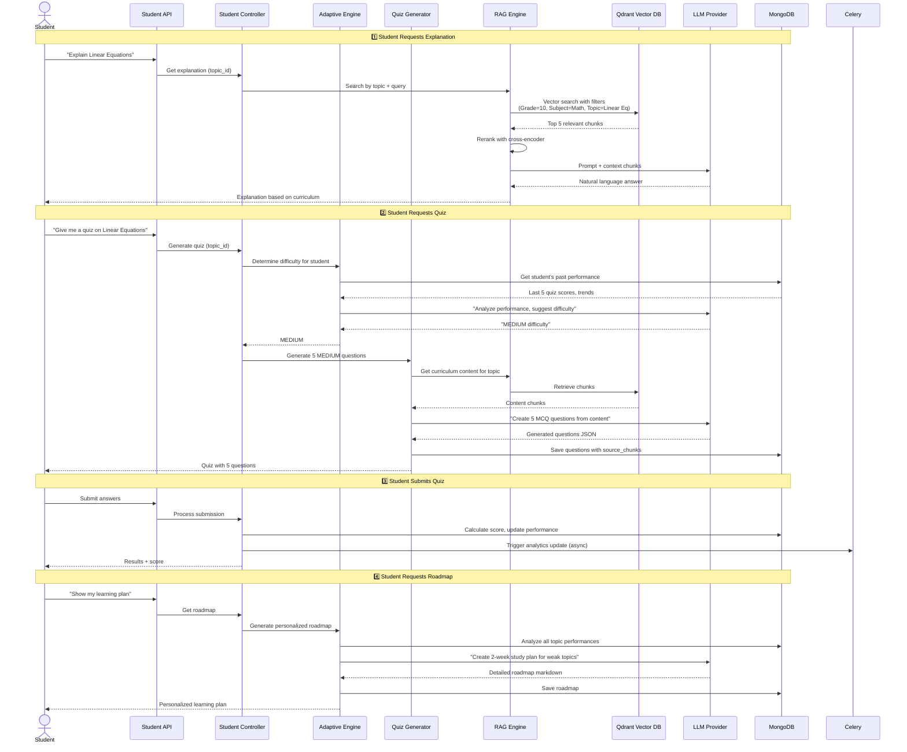
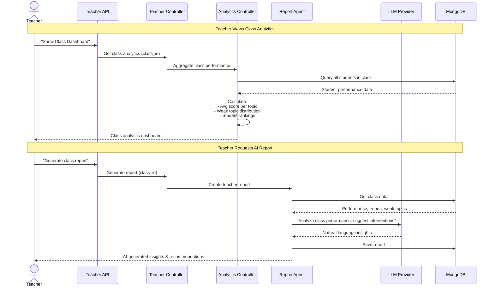
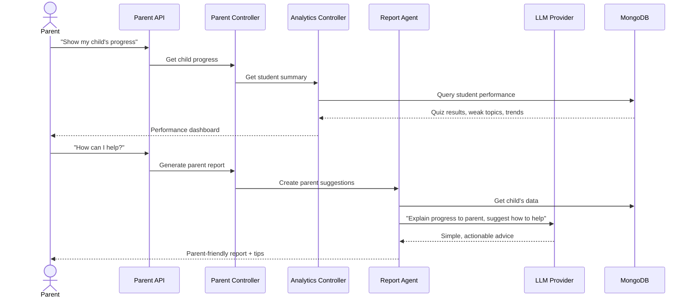
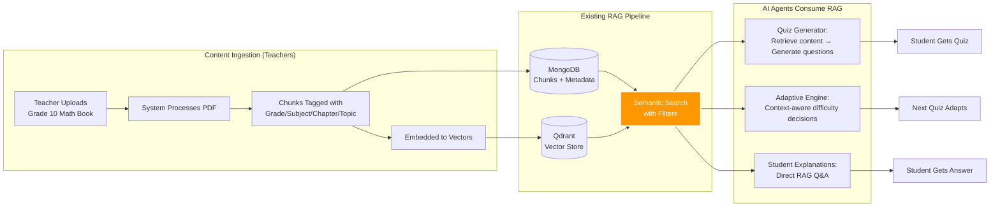

# Contest-Rag

A robust Retrieval-Augmented Generation (RAG) system built with FastAPI, MongoDB, and Qdrant. This application allows users to upload documents, automatically chunk and index them, and perform context-aware Q&A using advanced LLMs.

## System Architecture

This platform transforms a basic RAG system into a complete AI-powered educational ecosystem serving **students**, **teachers**, and **parents**.

### High-Level Architecture



### 🔍 Role of Your Existing RAG System

Your current RAG pipeline (`NLPController`) is the **foundation** - it doesn't get replaced, it gets **enhanced and utilized by AI agents**:

| Component | Role in New System |
|-----------|-------------------|
| **Document Upload & Chunking** | Still used - teachers upload curriculum books |
| **Vector Store (Qdrant)** | Core semantic search engine for all features |
| **RAG Q&A** | Powers student explanations + used by quiz generator |
| **Cross-Encoder Reranking** | Ensures high-quality context for all AI operations |
| **LLM Integration** | Shared by RAG answers + AI agents |

**Key Enhancement:** RAG now includes **curriculum hierarchy filtering** (Grade → Subject → Chapter → Topic) instead of flat project-level search.

---

## User Flow Diagrams

### 👨‍🎓 Student Learning Flow



### 👩‍🏫 Teacher Analytics Flow



### 👨‍👩‍👦 Parent Progress Flow



---

## Data Flow: How RAG Powers Everything



---

## Key Enhancements to Existing RAG

### Before (Current System)
```python
# Simple project-level search
search_result = nlp_controller.search_vector_db_collection(
    project="my_project",
    text="What is photosynthesis?",
    limit=5
)
```

### After (Enhanced with Curriculum)
```python
# Hierarchical filtered search
search_result = nlp_controller.search_by_curriculum(
    grade=10,
    subject="Biology",
    chapter="Plant Biology",
    topic="Photosynthesis",
    text="What is photosynthesis?",
    limit=5
)
# Returns ONLY chunks from Grade 10 Biology > Plant Biology > Photosynthesis
```

**Impact:** More accurate, relevant results for educational content.


## How It Works

Here is a short and simple explanation of each part of the project:

### 1. The Web Server (FastAPI)
Think of this as the front desk. It receives your requests (like "upload this file" or "answer this question") and directs them to the right department.

### 2. The Database (MongoDB)
This is the filing cabinet. It stores your uploaded files and keeps track of all the small text pieces (chunks) we make from them.

### 3. The Vector Store (Qdrant)
This is the smart index. It doesn't just store words; it stores the *meaning* of the text as numbers (vectors). This allows the system to find relevant information even if the exact keywords don't match.

### 4. The Brains (LLM)
This is the intelligent part (like OpenAI or Gemini). It reads the relevant information found by Qdrant and writes a clear answer to your question.

### 5. The Workflow
1.  **Ingestion**: You upload a PDF. We chop it into small pieces (chunks) and save them to MongoDB.
2.  **Indexing**: We turn those chunks into "vectors" (meaning-numbers) and save them in Qdrant.
3.  **Search**: You ask a question. We turn your question into a vector and find the most similar chunks in Qdrant.
4.  **Answer**: We give those chunks to the LLM and say "Answer this question using these notes."

## Tech Stack

-   **Backend Framework**: [FastAPI](https://fastapi.tiangolo.com/) - High-performance async web framework.
-   **Database**:
    -   [MongoDB](https://www.mongodb.com/) (via [Motor](https://motor.readthedocs.io/)) - Stores raw document assets and metadata.
    -   [Qdrant](https://qdrant.tech/) - Vector database for efficient semantic search.
-   **AI & LLM**:
    -   [LangChain](https://www.langchain.com/) - Orchestration framework.
    -   **LLMs**: Supports OpenAI, Gemini, and Cohere.
-   **Processing**:
    -   [PyMuPDF](https://pymupdf.readthedocs.io/) - efficient PDF processing.

## Key Features

-   **Document Ingestion**: Upload PDF documents via REST API.
-   **Automatic Indexing**: Documents are automatically processed, chunked, and embedded into the vector store.
-   **Context-Aware QA**: Ask questions about your documents and receive answers grounded in the uploaded content.
-   **Hybrid Storage**: Combines MongoDB for document management with Qdrant for vector search.

## AI Roles in the System

This platform leverages AI to empower all stakeholders in the educational ecosystem:

### 1. For Students: The Intelligent Learning Companion
*   **Context-Aware Explanations**: Provides detailed explanations based specifically on the materials provided by the teacher, ensuring accuracy and relevance.
*   **Smart Question Banks**: Automatically generates quizzes and practice questions indexed by historical exam patterns to help students prepare effectively.
*   **Performance Analytics**: Measures the student's level and tracks contest performance to identify specific gaps.
*   **Personalized Future Plans**: Generates a tailored roadmap to address weak points and improve overall learning outcomes.

### 2. For Teachers & Schools: Proactive Educational Management
*   **Student Progress Monitoring**: Offers high-level insights into student performance trends across different subjects.
*   **Problem Identification**: Pinpoints specific areas where multiple students are struggling, suggesting potential curriculum adjustments or focused review sessions.
*   **Curriculum Alignment**: Ensures that the AI-generated content remains strictly within the bounds of the provided educational resources.

### 3. For Parents: Transparent Progress Tracking
*   **Automated Reporting**: Generates periodic reports detailing the child's strengths, weaknesses, and improvement over time.
*   **Guided Support**: Helps parents understand exactly what their child needs to work on, making home-based support more effective.

---

## Why this Platform? (vs. ChatGPT/NotebookLM)

While general tools like ChatGPT or specialized ones like NotebookLM are powerful, this platform offers a tailored ecosystem for institutional learning:

| Feature | Contest-Rag Platform | General LLMs (ChatGPT) | NotebookLM |
| :--- | :--- | :--- | :--- |
| **Data Privacy** | Full control over source documents | Data may be used for training | Limited to Google ecosystem |
| **Contest Integration** | Built-in contest platform & ranking | None | None |
| **Stakeholder Reports** | Custom reports for parents/teachers | None | Personal use only |
| **Structured Analytics** | In-depth weak point analysis | Chat-based only | Document-based only |
| **Learning Roadmap** | AI-generated plans based on history | Generic advice | None |

This platform is not just a chatbot; it's a comprehensive **Educational Management System** powered by RAG technology.

## Getting Started

1.  **Clone the repository**:
    ```bash
    git clone <repository_url>
    cd Contest-Rag
    ```

2.  **Set up environment variables**:
    Copy `.env.example` to `.env` and configure your API keys (OpenAI/Gemini) and database credentials.

3.  **Run with Docker**:
    ```bash
    docker-compose up -d
    ```

4.  **Access the API**:
    Navigate to `http://localhost:8000/docs` to view the interactive API documentation.

## API Usage

Here are the essential `curl` commands to interact with the API.

### 1. Check Health
```bash
curl -X GET "http://localhost:8000/api/v1/"
```

### 2. Upload Document
Upload a PDF file to the system.
```bash
curl -X POST "http://localhost:8000/api/v1/data/upload/my_project" \
     -H "Content-Type: multipart/form-data" \
     -F "file=@/path/to/your/document.pdf"
```

### 3. Process Document
Chunk the uploaded document.
```bash
curl -X POST "http://localhost:8000/api/v1/data/process/my_project" \
     -H "Content-Type: application/json" \
     -d '{
           "chunk_size": 100,
           "overlap_size": 20,
           "do_reset": 0
         }'
```

### 4. Index Data
Push processed chunks to Qdrant vector store.
```bash
curl -X POST "http://localhost:8000/api/v1/nlp/index/push/my_project" \
     -H "Content-Type: application/json" \
     -d '{"do_reset": 0}'
```

### 5. Search Index
Semantic search for relevant context.
```bash
curl -X POST "http://localhost:8000/api/v1/nlp/index/search/my_project" \
     -H "Content-Type: application/json" \
     -d '{
           "text": "What is the summary of the document?",
           "limit": 5
         }'
```

### 6. RAG Answer
Ask a question and get an AI-generated answer.
```bash
curl -X POST "http://localhost:8000/api/v1/nlp/index/answer/my_project" \
     -H "Content-Type: application/json" \
     -d '{
           "text": "Explain the key findings.",
           "limit": 5
         }'
```
