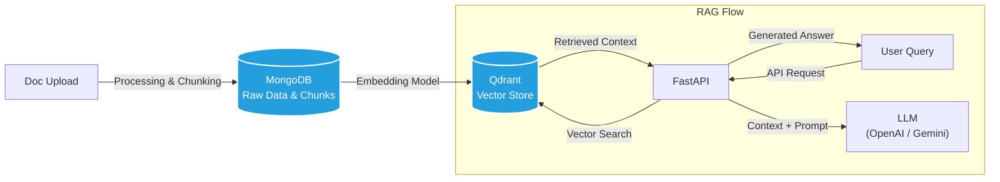
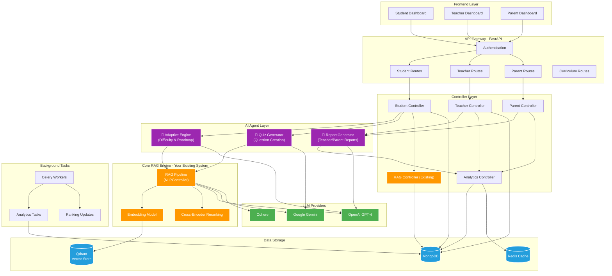
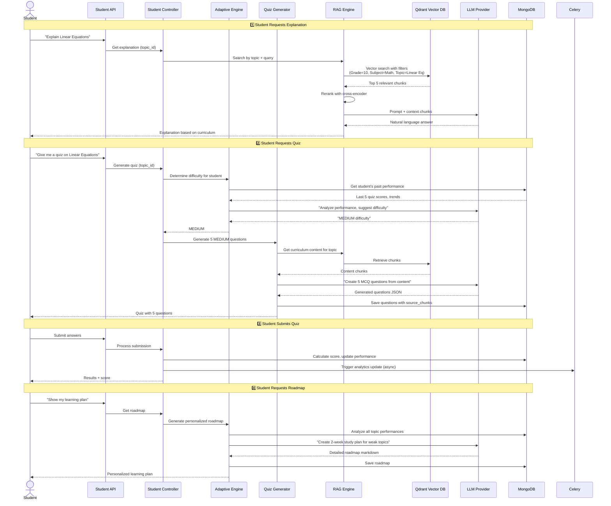
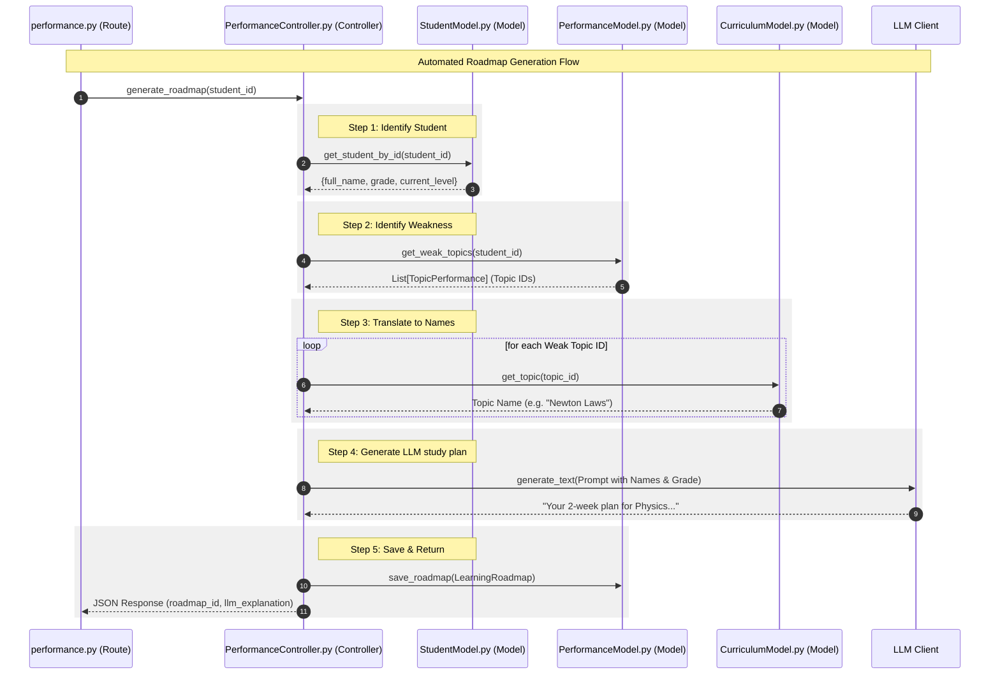
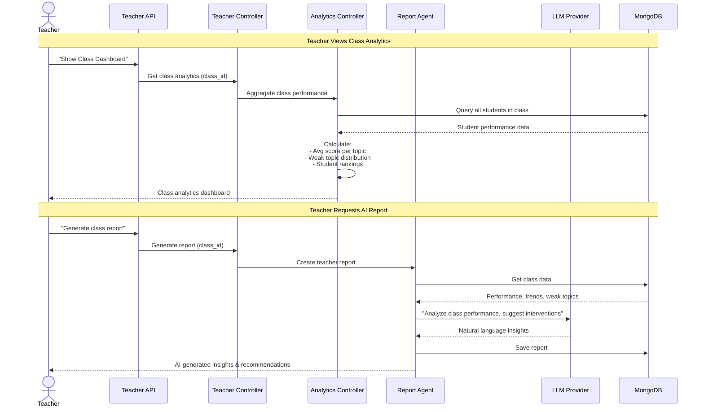
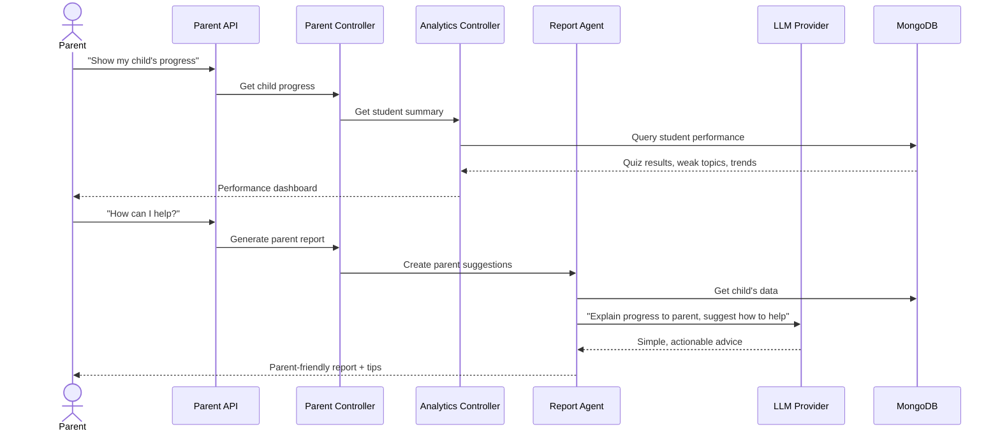
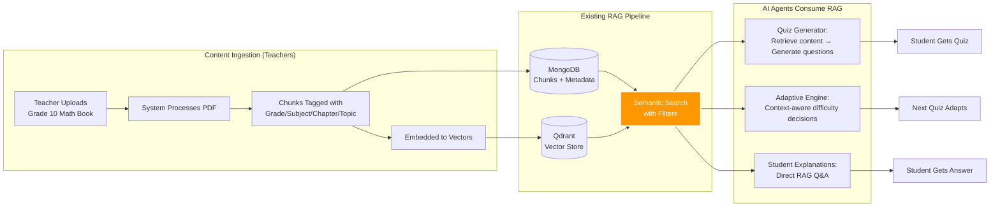

# Contest-Rag

A robust Retrieval-Augmented Generation (RAG) system built with FastAPI, MongoDB, and Qdrant. This application allows users to upload documents, automatically chunk and index them, and perform context-aware Q&A using advanced LLMs.

## System Architecture

This platform transforms a basic RAG system into a complete AI-powered educational ecosystem serving **students**, **teachers**, and **parents**.

### High-Level Architecture
### simple Rag


### We need in our system



### 🔍 Role of Your Existing RAG System

Your current RAG pipeline (`NLPController`) is the **foundation** - it doesn't get replaced, it gets **enhanced and utilized by AI agents**:

| Component | Role in New System |
|-----------|-------------------|
| **Document Upload & Chunking** | Still used - teachers upload curriculum books |
| **Vector Store (Qdrant)** | Core semantic search engine for all features |
| **RAG Q&A** | Powers student explanations + used by quiz generator |
| **Cross-Encoder Reranking** | Ensures high-quality context for all AI operations |
| **LLM Integration** | Shared by RAG answers + AI agents |

**Key Enhancement:** RAG now includes **curriculum hierarchy filtering** (Grade → Subject → Chapter → Topic) instead of flat project-level search.

---

## User Flow Diagrams

### 👨‍🎓 Student Learning Flow



### 🛡️ Detailed Roadmap Generation (Automated)

This diagram shows how the system automatically fetches student and performance data to inform the AI, without requiring manual input of topic names.


### 👩‍🏫 Teacher Analytics Flow



### 👨‍👩‍👦 Parent Progress Flow



---

## Data Flow: How RAG Powers Everything



---

## Key Enhancements to Existing RAG

### Before (Current System)
```python
# Simple project-level search
search_result = nlp_controller.search_vector_db_collection(
    project="my_project",
    text="What is photosynthesis?",
    limit=5
)
```

### After (Enhanced with Curriculum)
```python
# Hierarchical filtered search
search_result = nlp_controller.search_by_curriculum(
    grade=10,
    subject="Biology",
    chapter="Plant Biology",
    topic="Photosynthesis",
    text="What is photosynthesis?",
    limit=5
)
# Returns ONLY chunks from Grade 10 Biology > Plant Biology > Photosynthesis
```

**Impact:** More accurate, relevant results for educational content.

