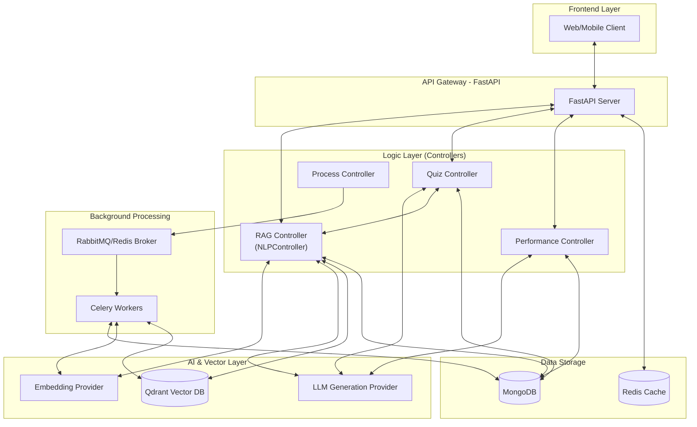
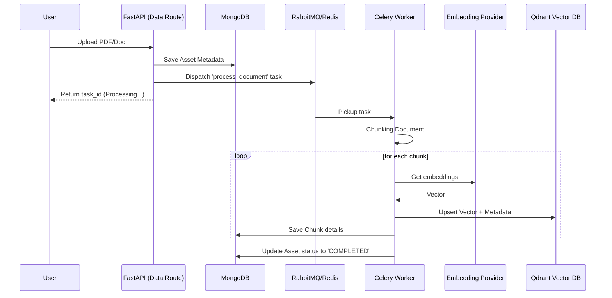
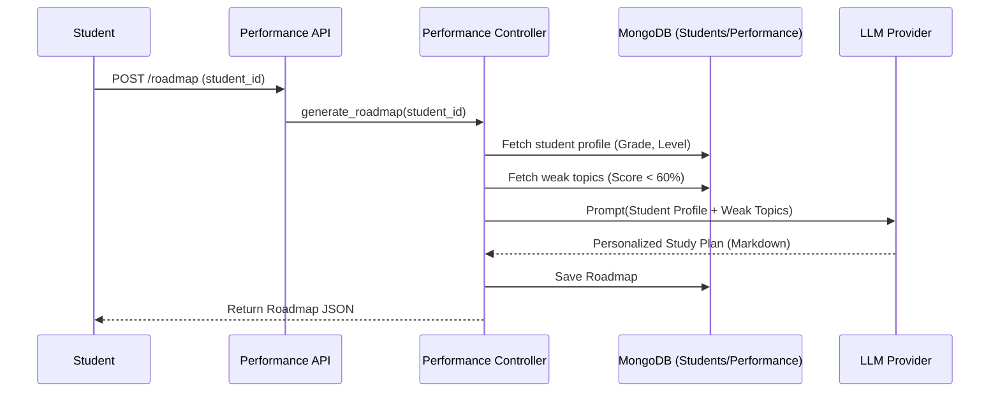
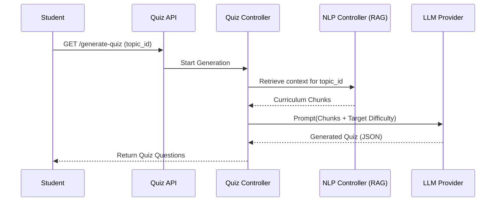

# Contest-Rag

An advanced AI-powered educational platform that leverages **Retrieval-Augmented Generation (RAG)** to provide personalized learning experiences. The system allows educators to upload curriculum materials, which are then used to power context-aware Q&A, automated quiz generation, and personalized student roadmaps.

## 🚀 Key Features

- **Robust RAG Engine**: High-fidelity semantic search using Qdrant and cross-encoder reranking.
- **Automated Quiz Generation**: Dynamically creates quizzes from uploaded curriculum content, tailored to student difficulty levels.
- **Personalized Roadmaps**: Automatically generates two-week study plans based on student performance data and identified weak topics.
- **Curriculum Hierarchy**: Organizes content by Grade, Subject, Chapter, and Topic for precise contextual retrieval.
- **Async Processing**: Leverages Celery for background document chunking and embedding to ensure a responsive API.
- **Scalable Architecture**: Built with FastAPI, MongoDB, Qdrant, and Redis.

## 🏗️ System Architecture

The platform is designed as a modular ecosystem where specialized controllers interact with AI providers and multi-modal data stores.

### High-Level Architecture


---

## 🔄 Core Data Flows

### 1. Document Ingestion (Async Pipeline)
This flow handles the transition from raw PDF documents to a searchable vector index.



### 2. Automated Roadmap Generation
Uses student performance history to identify weak areas and generate a custom learning plan via LLM.



### 3. Quiz Generation (RAG-Driven)
How the system ensures quizzes are factually grounded in the uploaded curriculum.



---

## 📁 Project Structure

```text
/
├── src/
│   ├── AI/              # LLM & Vector DB Providers
│   ├── controllers/     # Business logic (NLP, Quiz, Performance)
│   ├── models/          # MongoDB Schemas & DB Logic
│   ├── routes/          # FastAPI Route Definitions
│   ├── tasks/           # Celery Background Tasks
│   ├── main.py          # App Entry Point
│   └── celery_app.py    # Celery Configuration
├── Docker/              # Dockerfiles for services
├── docker-compose.yml   # Multi-container setup
└── pyproject.toml       # Dependencies (Managed by uv/pip)
```

---

## 🛠️ Setup & Installation

### Environment Configuration
1. Copy the example environment file:
   ```bash
   cp src/.env.example src/.env
   ```
2. Fill in your API keys and configuration (OpenAI, Gemini, Qdrant, MongoDB, etc.).

### Running with Docker (Recommended)
The project is containerized for easy deployment:
```bash
docker-compose up --build
```
This will spin up:
- **FastAPI App**: Port 8000
- **MongoDB**: Primary Store
- **Qdrant**: Vector Search Engine
- **Redis**: Caching & Background Task Result Backend
- **RabbitMQ**: (Optional if used as Celery Broker)

### Local Development
Ensure you have Python 3.10+ and `uv` installed:
```bash
# Install dependencies
uv sync

# Run the API
uv run fastapi dev src/main.py

# Run Celery Worker
uv run celery -A src.celery_app worker --loglevel=info
```

## 🔐 API Documentation
Once the server is running, visit:
- **Swagger Docs**: `http://localhost:8000/docs`
- **ReDoc**: `http://localhost:8000/redoc`

### Principal Routes:
- `/api/v1/nlp`: RAG search and Q&A.
- `/api/v1/quiz`: Quiz generation and management.
- `/api/v1/performance`: Analytics and personalized roadmaps.
- `/api/v1/data`: Document upload and processing status.

