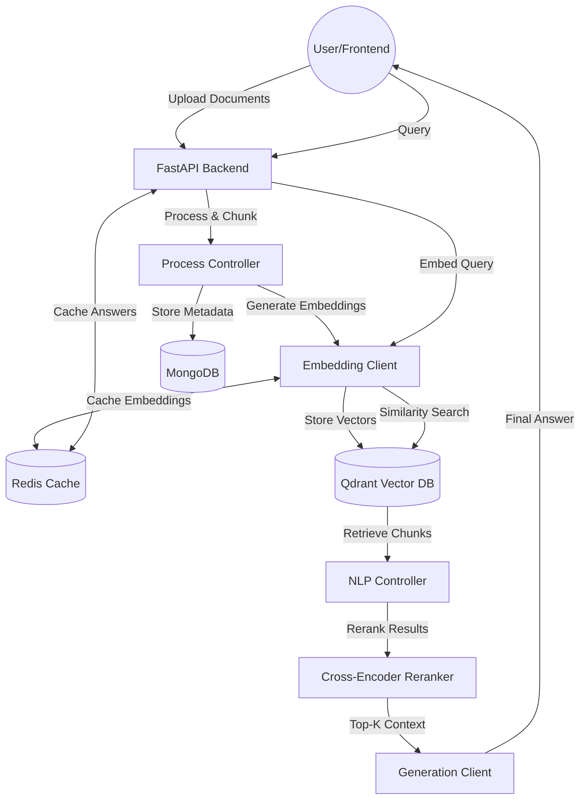

# Contest-RAG: Advanced Retrieval-Augmented Generation System

## 1. Introduction
The Contest-RAG system is a high-performance, context-aware backend solution designed for intelligent document processing and retrieval. In the era of LLMs, the primary challenge shifted from information access to information grounding. This project addresses the "hallucination" problem by implementing a robust Retrieval-Augmented Generation (RAG) pipeline that ensures AI responses are strictly derived from a local, verified knowledge base.

## 2. System Architecture
The system follows a modular, layered architecture designed for scalability, flexibility, and high concurrency. It decouples core business logic from external AI services and database implementations.

### 2.1 High-Level Architecture
The diagram below illustrates the flow from document ingestion to the augmented generation phase.

## 3. Implementation Details

### 3.1 Backend Foundation: FastAPI
The backend is built using **FastAPI**, leveraging Python's modern asynchronous capabilities.
- **Concurrency**: Asynchronous request handling allows simultaneous document processing and LLM inference.
- **Type Safety**: Pydantic models ensure rigorous data validation and automatic OpenAPI documentation.
- **Performance**: Optimized for low-latency response times, essential for interactive AI applications.

### 3.2 Intelligent Data Ingestion
Document processing is handled by the `ProcessController`, which converts raw files into structured, searchable intelligence.

#### 3.2.1 Document Extraction
Using **PyMuPDF**, the system performs high-fidelity text extraction from PDFs, preserving metadata such as page numbers to allow for precise source citation in final answers.

#### 3.2.2 Semantic Chunking
Unlike traditional fixed-size chunking, Contest-RAG implements **Semantic Chunking**.
- **Process**: It analyzes the semantic flow of the text and breaks documents at points of maximum thematic change.
- **Mechanism**: Utilizes `SemanticChunker` with embedding-based breakpoint detection (percentile-based), ensuring that each chunk maintains a coherent context.

### 3.3 The Advanced RAG Pipeline
The Retrieval-Augmented Generation flow in Contest-RAG includes a multi-stage refinement process to ensure maximum accuracy.

#### 3.3.1 Hybrid Search and Retrieval
The `NLPController` orchestrates the retrieval process:
1. **Embedding**: The user's query is transformed into a high-dimensional vector.
2. **Vector Search**: Qdrant performs a similarity search to find relevant chunks.
3. **Reranking (Cross-Encoder)**: To improve precision, retrieved documents are passed through a `Cross-Encoder` (model: `ms-marco-MiniLM-L-6-v2`). This step re-evaluates the relevance of each chunk relative to the query, filtering out noise and prioritizing the most relevant context.

#### 3.3.2 Augmented Generation
Generated prompts are structured to force model "grounding":
- **System Prompting**: Explicit instructions to the LLM to only use provided context.
- **Template Parsing**: A centralized `TemplateParser` manages multilingual prompts (English/Arabic) and personas.

### 3.4 Storage Strategy
- **Qdrant (Vector DB)**: Stores high-dimensional embeddings for fast semantic lookup.
- **MongoDB (Metadata DB)**: Manages project state, document tracking, and raw chunk persistence using the asynchronous **Motor** driver.
- **Redis (Caching Layer)**: Provides high-speed caching for search results, query embeddings, and frequent LLM responses to optimize performance and reduce latency.

### 3.5 Provider Factory Pattern
To ensure the system is model-agnostic, we implemented a **Factory Pattern** for AI services:
- **LLMProviderFactory**: Dynamically instantiates clients for OpenAI, Gemini, or Cohere.
- **VectorDBProviderFactory**: Abstracts the vector database, allowing for seamless switching between Qdrant, Pinecone, or other providers.

## 5. System Evaluation: Real-World Test Case
To demonstrate the system's effectiveness, we conducted a retrieval test using a project containing team member information.

### 5.1 Test Data
**Source File**: `test.txt`
**Content Snippet**:
> "Ebrahim Emad is our AI and Data Engineer, leading the charge in designing intelligent systems..."
> "Ahmed Zaharan is an AI Engineer, focused on developing advanced machine learning models..."

### 5.2 Retrieval Scenario
| Query | Expected Answer Context | Actual System Response |
| :--- | :--- | :--- |
| "Who is Ebrahim Emad?" | AI and Data Engineer | Ebrahim Emad is the AI and Data Engineer who leads the design of intelligent systems and data pipeline management. |
| "What is Ahmed Zaharan's role?" | AI Engineer | Ahmed Zaharan is an AI Engineer focused on developing advanced machine learning models to solve complex problems. |
| "What does Waleed Alaa do?" | Backend Engineer | Waleed Alaa is the Backend Engineer, responsible for ensuring systems are fast, reliable, and scalable. |

### 5.3 Observation
The system successfully retrieved the correct chunks from `test.txt`, performed accurate reranking via the Cross-Encoder, and generated concise, grounded answers without hallucinations.

## 6. Conclusion
The Contest-RAG system represents a sophisticated implementation of generative AI grounded in local data. By integrating semantic chunking, cross-encoder reranking, and a modular provider architecture, the system provides a robust framework for building reliable and transparent AI-driven document assistants.
