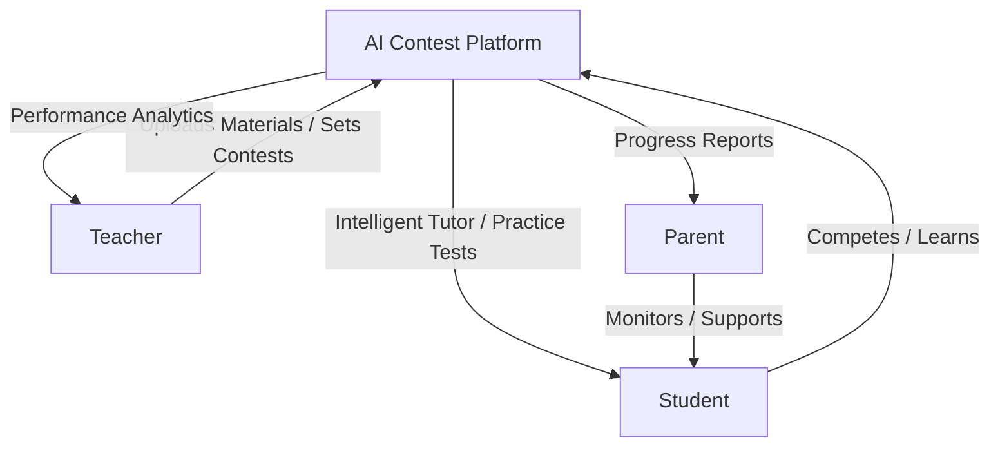
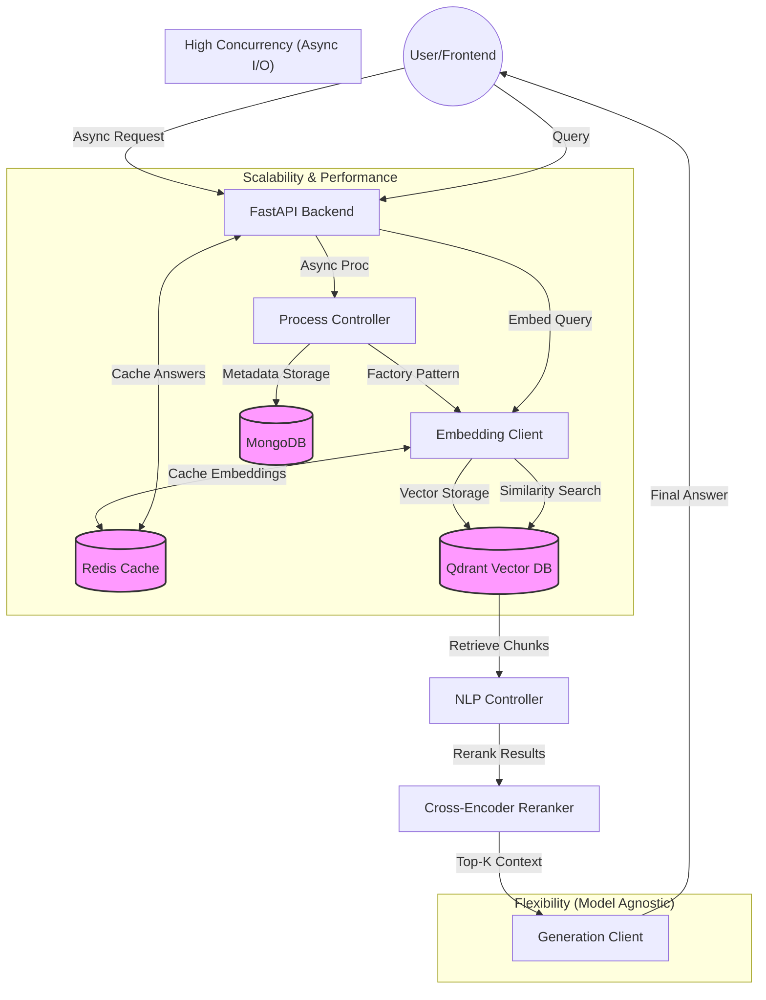

# Presentation Outline: AI-Powered Educational RAG System

## Slide 1:Stakeholder Ecosystem
*   **Title**: AI-Powered Educational Assistant
*   **Headline**: A Unified Educational Infrastructure
*   **Visual**:

*   **Key Point**: Every stakeholder is connected through a single source of truth (the educational data).

---

## Slide 3: The Role of AI for Students
*   **Headline**: Empowering the Learner's Journey
*   **Points**:
    *   **Intelligent Explanations**: Teaching complex concepts using specific teacher-provided materials (Context-Aware).
    *   **Smart Question Banks**: AI analyzes historical data and document content to generate relevant exam-style questions.
    *   **Performance Tracking**: Measuring progress in real-time during contests.
    *   **Personal Roadmap**: Identifying "Weak Points" and generating a **Future Plan** for targeted improvement.

---

## Slide 3: The Role of AI for Educators
*   **Headline**: Smarter Classroom Management
*   **Points**:
    *   **Holistic Monitoring**: Real-time visibility into student levels and common struggle areas.
    *   **Gap Detection**: Highlighting where the curriculum might be too difficult or where students need more support.
    *   **Resource Alignment**: Ensuring AI feedback stays consistent with the school's approved materials.

---

## Slide 4: The Role of AI for Parents
*   **Headline**: Bridging the Home & School Gap
*   **Points**:
    *   **Insightful Reporting**: Automated, easy-to-read reports on their child's progress.
    *   **Actionable Data**: Knowing exactly where the child needs help, rather than generic grades.
    *   **Engagement**: Enabling parents to be more involved in the learning process with clear metrics.

### 2.1 High-Level Architecture
The diagram below illustrates the design principles that make the system robust and adaptable.

---

## 2.2 Core Design Pillars

### 1. Flexibility via Design Patterns
The system uses the **Factory Pattern** to remain model-agnostic, allowing for seamless switching between different AI providers (OpenAI, Gemini, etc.) without changing the core business logic.

> [!TIP]
> **Implementation Note**: See `LLMProviderFactory.py` where providers are dynamically instantiated based on configuration.

### 2. High Concurrency
The system leverages Python's modern **Asynchronous I/O** capabilities to handle multiple requests and heavy AI processing simultaneously without blocking.
*   **FastAPI**: Built on `anyio/starlette` for high-performance async request handling.
*   **Async Drivers**: Uses `motor` for non-blocking MongoDB access.
*   **Async Ingestion**: Document processing and embedding generation are handled asynchronously to keep the API responsive.

### 3. Scalability & Performance
Scalability is addressed through distributed storage and aggressive caching layers.
*   **Caching Strategy**: Redis is used to cache **Embeddings** (avoiding redundant API costs) and **LLM Answers** (providing instant responses for repeated queries).
*   **Distributed Storage**: 
    *   **Qdrant**: A dedicated high-performance vector database for billion-scale similarity searches.
    *   **MongoDB**: Flexible metadata storage that scales without rigid schema constraints.

